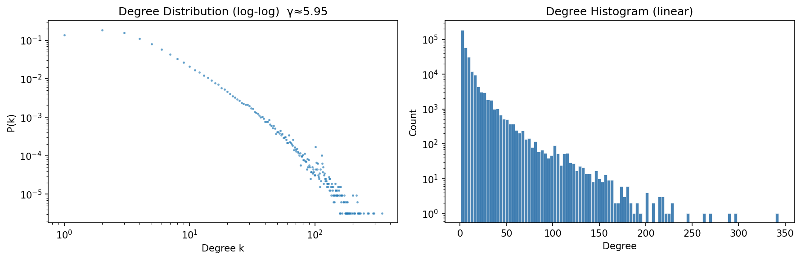
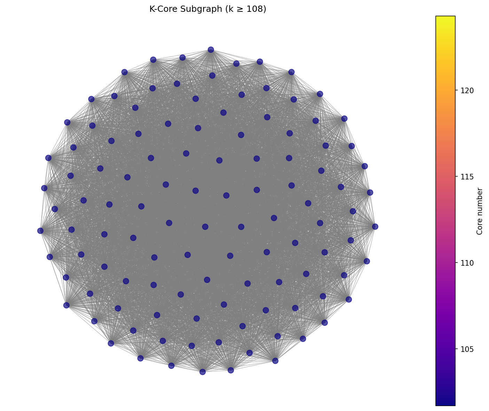
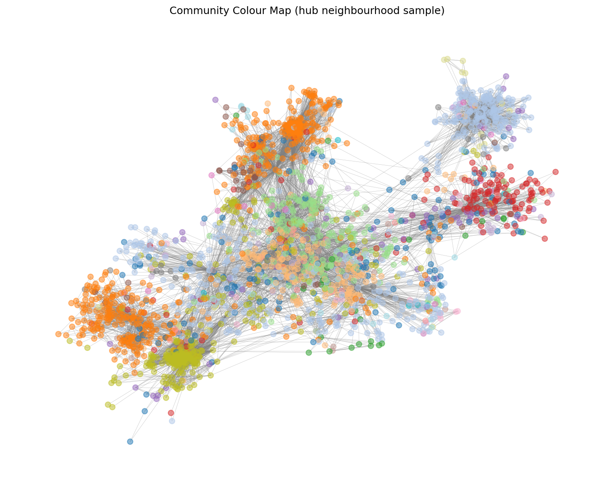
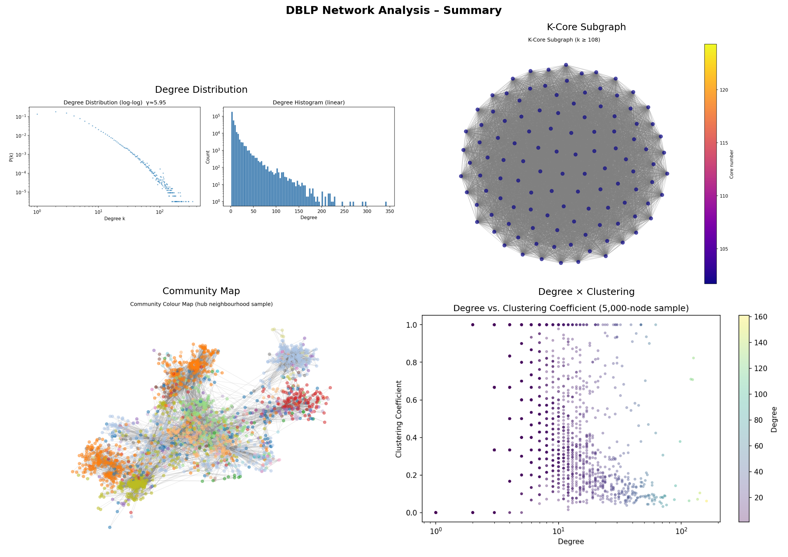

# DBLP-Structural-Analysis-Hidden-Structure-of-CS-Research-

Graph-theoretic analysis of the DBLP co-authorship network using
k-core decomposition, centrality, community detection, and
small-world modeling.

## Highlights
- 317,080 researchers, 1,049,866 collaborations
- Scale-free degree structure
- Small-world phenomenon
- 108-core dense collaboration nucleus
- Louvain communities compared to ground truth (NMI/ARI)

## Key Visual Results

## Key Findings
- Heavy-tailed degree distribution
- Average path length ≈ 6.8
- Maximum k-core = 108
- Dense core-periphery structure
- Louvain recovers meaningful research communities

## Project Overview

## Methods
- PageRank
- Betweenness Centrality
- k-Core Decomposition
- Louvain Community Detection
- Label Propagation
- Ground Truth Evaluation (NMI, ARI)

## Open Problems
- Symmetry in collaboration networks
- Spectral structure of k-cores
- Automorphism-rich motifs
